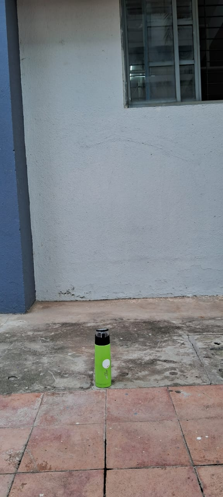
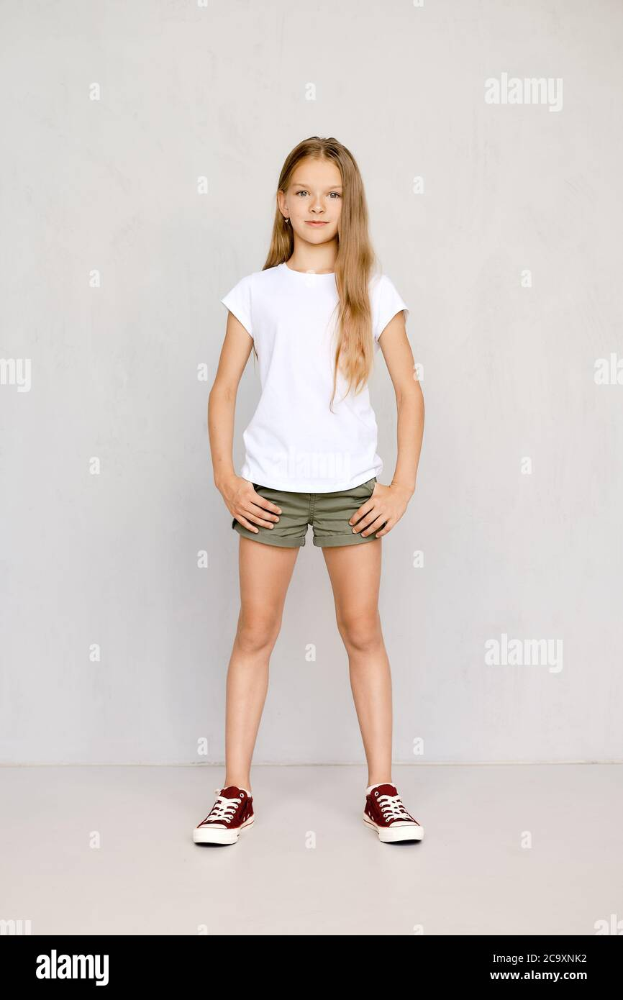
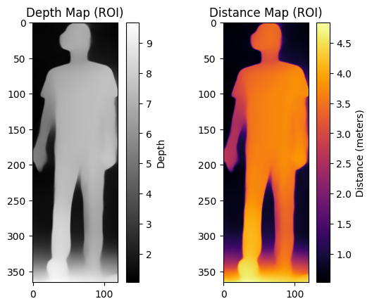

# Height Detection and BMI Analysis System

> **Note:** This is the backend component of an Android application being developed by Skids Health for height measurement. The system is designed to be integrated with a mobile frontend for easy height measurement and health tracking.

## Overview

This project implements a computer vision-based system for detecting human height and analyzing it against WHO growth standards. The system uses YOLO for person detection and depth estimation for accurate height measurement.

The system consists of two main components:
1. **Height Detection**: Uses YOLO for person detection and depth estimation to measure height
2. **BMI Analysis**: Compares measurements against WHO growth standards

## Table of Contents
- [Overview](#overview)
- [How to Use](#how-to-use)
- [How It Works](#how-it-works)
- [Key Components](#key-components)
- [Installation](#installation)
- [Usage](#usage)
- [File Structure](#file-structure)
- [Troubleshooting](#troubleshooting)

## Overview

The system consists of two main components:
1. **Height Detection**: Uses YOLO for person detection and depth estimation to measure height
2. **BMI Analysis**: Compares measurements against WHO growth standards

## How to Use

### Calibration Using a Reference Object

1. **Prepare Your Setup**
   - Place a reference object (like a bottle) at a known distance from the camera (e.g., 1 meter)
   - Ensure the object is clearly visible and properly lit
   - Make sure the object is placed on a flat surface

   /**/
   *Figure 1: Reference object (bottle) placed at a known distance from the camera*
   

2. **Capture the Reference Image**
   - Take a clear photo of the reference object
   - Make sure the entire object is within the frame

3. **Run the Detection on Reference Object**
   ```bash
   python dpt.py --image path_to_reference_image.jpg
   ```
   - The script will display the detected height of the reference object
   

4. **Calculate the Scaling Factor**
   - Let's say the actual height of your reference object is A cm
   - The script reports a height of B cm
   - Calculate the scaling factor: `SCALING_FACTOR = A / B`

5. **Update the Scaling Factor**
   - Open `dpt.py` in a text editor
   - Find the line: `SCALING_FACTOR = 1`
   - Replace `1` with your calculated scaling factor
   - Save the file

6. **Measuring a Person's Height**
   - Have the person stand at the exact same distance where the reference object was placed
   - Make sure they stand straight and fully visible
   - Capture their image
   - Run the script:
     ```bash
     python dpt.py --image path_to_person_image.jpg
     ```
   - The script will display:
     - Bounding box around the person
     - Depth map visualization
     - Calculated height in the command prompt
     
   *Figure 2: Person detection with height measurement*

   

   

   
   *Figure 3: Depth map used for height calculation*

### Important Notes
- Maintain consistent lighting conditions during calibration and measurement
- Ensure the camera position and angle remain the same
- The reference object and person should be on the same flat surface
- For best results, use a reference object with a known, precise height

## How It Works

### 1. Person Detection
- Uses YOLOv8 model (`yolov10n.pt`) to detect persons in the image
- Extracts the region of interest (ROI) containing the person

### 2. Pose Estimation
- Utilizes MediaPipe for pose estimation
- Identifies key body landmarks for height measurement

### 3. Depth Estimation
- Uses Depth-Anything model for depth map generation
- Calculates real-world measurements from the depth map

### 4. Height Calculation
- The `estimate_person_height` function in `dpt.py` calculates the height using:
  - The bounding box dimensions from YOLO
  - Depth information from the depth map
  - A scaling factor for real-world measurements

### 5. BMI and WHO Standards
- The `extracted_code.py` file contains functions to:
  - Calculate BMI from height and weight
  - Compare measurements against WHO growth standards
  - Generate z-scores for height-for-age and weight-for-age

## Key Components

### Main Files
- `dpt.py`: Main script for height detection
- `trial_Int_DPT_POSE.py`: Handles pose estimation
- `extracted_code.py`: BMI calculation and WHO standards comparison
- `data_zscore.ipynb`: Jupyter notebook for data analysis

### Models
- YOLOv8 for person detection
- Depth-Anything for depth estimation
- MediaPipe for pose estimation

## Installation

1. Create a virtual environment:
   ```bash
   python -m venv venv
   source venv/bin/activate  # On Windows: .\venv\Scripts\activate
   ```

2. Install dependencies:
   ```bash
   pip install -r requirements_clean.txt
   ```

3. Install PyTorch (if not already installed):
   ```bash
   pip3 install torch torchvision torchaudio --index-url https://download.pytorch.org/whl/cu118
   ```

## Usage

1. Run the height detection:
   ```bash
   python dpt.py
   ```

2. The script will:
   - Load the YOLO model
   - Process the input image
   - Detect persons and estimate heights
   - Display the results

## File Structure

```
.
├── dpt.py                    # Main height detection script
├── trial_Int_DPT_POSE.py     # Pose estimation utilities
├── extracted_code.py         # BMI and WHO standards calculation
├── data_zscore.ipynb         # Data analysis notebook
├── requirements_clean.txt    # Python dependencies
└── images/                   # Output visualizations
    ├── depth-map.png         # Sample depth map
    └── height.png            # Height measurement visualization
```


## Troubleshooting

### Common Issues
1. **DLL Load Error**: Ensure you have the latest Visual C++ Redistributable installed
2. **MediaPipe Installation**: Try `pip install mediapipe --no-cache-dir`
3. **CUDA Errors**: Make sure you have compatible CUDA drivers if using GPU

### Getting Help
For additional support, please open an issue in the repository.

---
*Note: This project is for educational and research purposes only. Always consult healthcare professionals for medical assessments.*